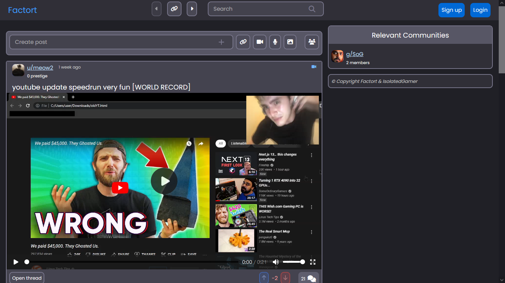
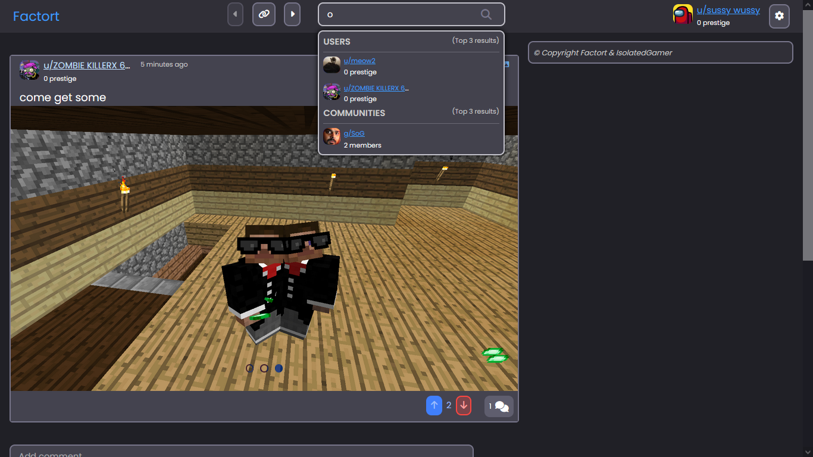
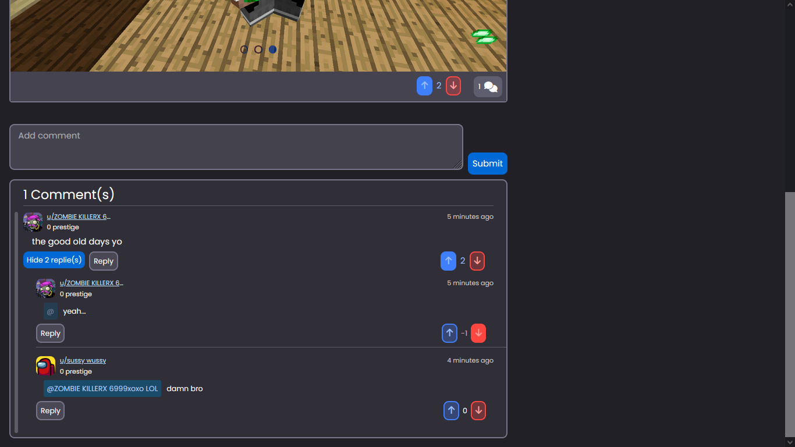
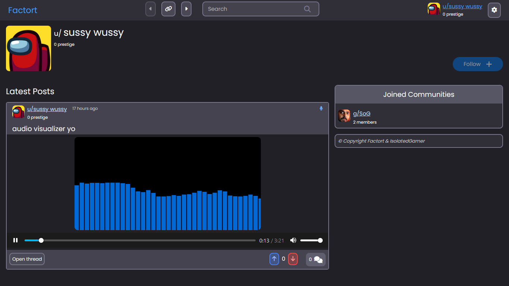
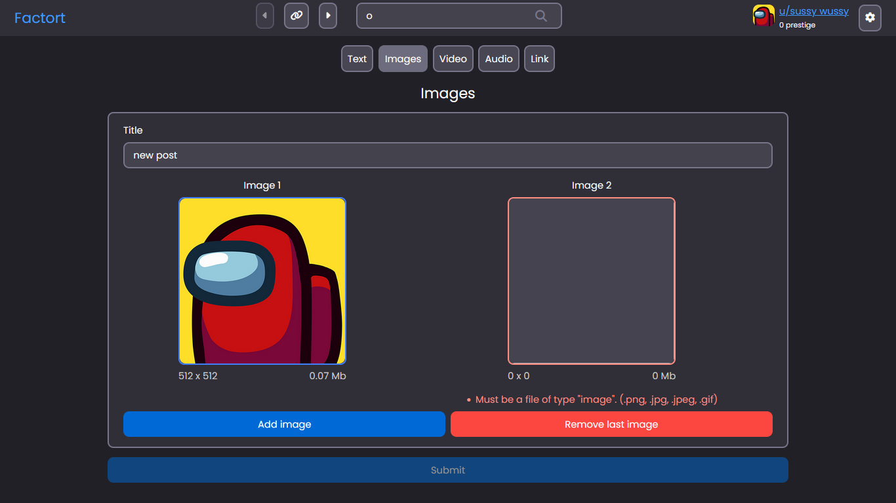
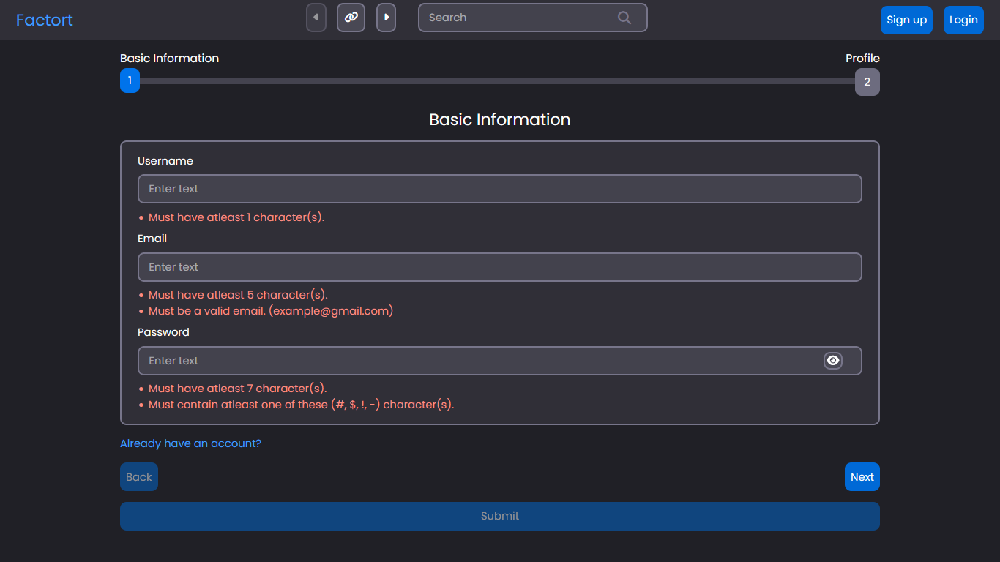
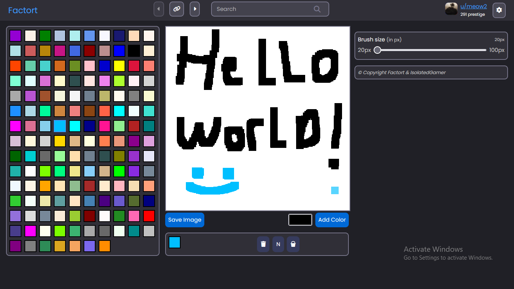

# Factort

A fully functional Open-Source social media application packed with many features, it shares similarities with [Reddit](https://www.reddit.com/).

## Technologies Used

[SvelteKit](https://kit.svelte.dev/),
[Django](https://www.djangoproject.com/),
[Sass](https://sass-lang.com/),
**In this project, I try my best to not use 3rd party packages and implement most things in my way, as an extra challenge and _for safety_.**

### Screenshots

## Home

## Post

## Post Comments

## User

## Post Creation

## Registration

## Drawer

